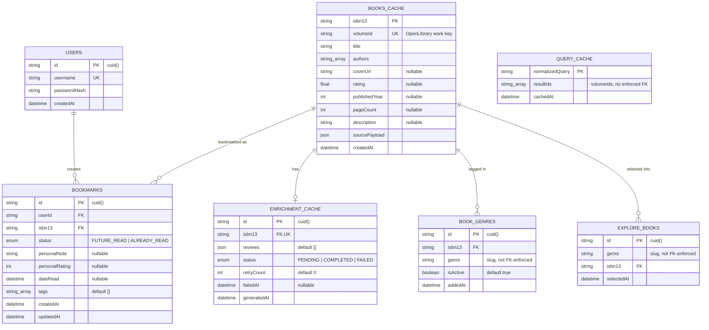

# Database ER Diagram — Hazelnut App

Source of truth: [`prisma/schema.prisma`](../prisma/schema.prisma). Postgres via the `@prisma/adapter-pg` driver adapter (`src/lib/prisma.ts`). No migrations directory exists yet — schema is applied directly (`prisma db push` / `prisma migrate`).

## Entity-Relationship Diagram

> **Note on `QUERY_CACHE`:** it has no formal foreign key — `resultIds` is a plain `String[]` of `books_cache.volumeId` values, joined in application code (`prisma.booksCache.findMany({ where: { volumeId: { in: resultIds } } })`). It isn't drawn as a relationship line above because Prisma/Postgres doesn't enforce it; a stale or missing `volumeId` is silently dropped by the app-side join.

## Tables

### `users` (`User`)
Application accounts. Minimal — username/password only, no email or profile fields.

| Column | Type | Notes |
|---|---|---|
| `id` | `String` (cuid) | PK |
| `username` | `String` | unique |
| `passwordHash` | `String` | bcrypt hash, cost factor 12 (`src/app/api/auth/register/route.ts`) |
| `createdAt` | `DateTime` | default `now()` |

Relations: one-to-many → `Bookmark` (`onDelete: Cascade` — deleting a user deletes their bookmarks).

Written by `src/app/api/auth/register/route.ts`; read by `src/app/api/auth/login/route.ts`. Auth issues a JWT (`src/lib/auth.ts`, `jose`, HS256, 30-day expiry) — no session table; the JWT itself is the session.

### `books_cache` (`BooksCache`)
The central book entity. Acts as a local cache of OpenLibrary search results, keyed by ISBN-13 but looked up by OpenLibrary's `volumeId` (work key, e.g. `/works/OL12345W`) almost everywhere.

| Column | Type | Notes |
|---|---|---|
| `isbn13` | `String` | **PK.** Falls back to `volumeId` when OpenLibrary doesn't return a clean ISBN-13 (see `extractIsbn13` in `src/lib/books.ts`) |
| `volumeId` | `String` | unique — the actual upsert key used by app code, since it's always present |
| `title` | `String` | |
| `authors` | `String[]` | |
| `coverUrl` | `String?` | OpenLibrary cover CDN URL |
| `rating` | `Float?` | rounded to 1 decimal on ingest |
| `publishedYear` | `Int?` | |
| `pageCount` | `Int?` | |
| `description` | `String?` | never populated from OL search (search API doesn't return it) |
| `sourcePayload` | `Json` | raw source payload slot; currently written as `{}` everywhere it's created |
| `createdAt` | `DateTime` | default `now()` |

Relations: one-to-one → `EnrichmentCache`; one-to-many → `Bookmark`, `BookGenre`, `ExploreBook`.

**Every write is an upsert on `volumeId`**, never a plain `create` — three separate call sites do this independently (`api/search/route.ts`, `api/books/[id]/reviews/route.ts`, `scripts/populate-explore-catalog.ts`), all following the same isbn13-fallback convention.

### `book_genres` (`BookGenre`)
The genre *catalog pool* — every book that has ever been tagged for a genre by the manual population script.

| Column | Type | Notes |
|---|---|---|
| `id` | `String` (cuid) | PK |
| `isbn13` | `String` | FK → `books_cache.isbn13` |
| `genre` | `String` | slug from `src/lib/genres.ts` (`GENRES`), not a DB enum or FK — validity is enforced only in app code |
| `isActive` | `Boolean` | default `true`; reserved for future soft-removal, not currently set to `false` anywhere |
| `addedAt` | `DateTime` | default `now()` |

Unique on `(isbn13, genre)`; indexed on `(genre, isActive)` for the pool-scan query in the refresh script.

Populated only by `scripts/populate-explore-catalog.ts` (manual, `npm run explore:populate`). Reruns are additive/idempotent — an existing `(isbn13, genre)` tag is left untouched, never reset.

### `explore_books` (`ExploreBook`)
The *currently displayed* selection per genre on the Explore page — a materialized, weighted-random sample drawn from `book_genres`.

| Column | Type | Notes |
|---|---|---|
| `id` | `String` (cuid) | PK |
| `genre` | `String` | slug, same convention as `BookGenre.genre` |
| `isbn13` | `String` | FK → `books_cache.isbn13` |
| `selectedAt` | `DateTime` | default `now()` |

Unique on `(genre, isbn13)`; indexed on `genre`.

Fully **wiped and reinserted** per genre by `scripts/refresh-explore-selection.ts` (`npm run explore:refresh`) inside a `$transaction([deleteMany, createMany])` — so it never grows unbounded and never holds a stale selection mid-refresh. Selection uses Efraimidis–Spirakis weighted sampling (weight = book rating, default 1) to pick up to 40 books from the active pool.

Read by:
- `api/explore/route.ts` — overview across all genres (`groupBy` for counts + a 12-per-genre preview).
- `api/explore/[genre]/route.ts` — full per-genre listing. Explicitly a **pure DB read**; no live OpenLibrary call happens on this path.

### `enrichment_cache` (`EnrichmentCache`)
LLM-generated review enrichment for a single book, one row per `isbn13`.

| Column | Type | Notes |
|---|---|---|
| `id` | `String` (cuid) | PK |
| `isbn13` | `String` | unique, FK → `books_cache.isbn13` |
| `reviews` | `Json` | array of `{ quote_text, attributed_to, source_name, source_url, source_date, confidence, verification_status }`; default `[]` |
| `status` | `EnrichmentStatus` | `PENDING \| COMPLETED \| FAILED` |
| `retryCount` | `Int` | default `0`, incremented on each `FAILED` outcome |
| `failedAt` | `DateTime?` | set on failure |
| `generatedAt` | `DateTime` | default `now()`, updated on successful completion |

Driven entirely by `src/app/api/books/[id]/reviews/route.ts` (SSE endpoint):
1. Resolve book metadata from `books_cache` (falls back to client-supplied query params if the cache is unreachable).
2. Check `enrichment_cache`: if `COMPLETED`, stream cached reviews (filtered to drop `verification_status: "fake"`); if `FAILED` and `retryCount >= 3` (`MAX_RETRIES`), stream empty + `exhausted: true`.
3. Otherwise upsert a `books_cache` row (FK requirement) and mark `enrichment_cache` `PENDING`, then call the OpenAI Responses API (`gpt-4o` + `web_search_preview`) live.
4. Persist the result as `COMPLETED` (or bump `retryCount`/`FAILED` on error). All DB writes on this path are wrapped individually in try/catch and treated as best-effort — a DB outage degrades functionality but never blocks the LLM call or the SSE stream.

`verification_status` is app-level tri-state (`unverified | verified | fake`) stored inside the JSON blob, not a DB enum — reads always filter out `fake`.

### `query_cache` (`QueryCache`)
Caches OpenLibrary search results per normalized query string.

| Column | Type | Notes |
|---|---|---|
| `normalizedQuery` | `String` | PK — `q.toLowerCase().trim().replace(/\s+/g, " ")` (`normalizeQuery` in `src/lib/books.ts`) |
| `resultIds` | `String[]` | ordered list of `books_cache.volumeId` |
| `cachedAt` | `DateTime` | default `now()` |

TTL of **30 days** enforced entirely in application code (`QUERY_CACHE_TTL_DAYS` in `api/search/route.ts`) — there's no DB-level expiry/cron. On a cache hit within TTL, `resultIds` is joined against `books_cache` and results are paginated in-memory (`offset`/`limit`, capped at 10 total). On a miss or stale entry, the route hits OpenLibrary live, upserts every returned book into `books_cache`, and re-upserts this row.

### `bookmarks` (`Bookmark`)
Per-user saved/read books. **Schema exists but no API route consumes it yet** — no `src/app/api/**/bookmarks` route was found; this table is written nowhere in the current codebase.

| Column | Type | Notes |
|---|---|---|
| `id` | `String` (cuid) | PK |
| `userId` | `String` | FK → `users.id`, `onDelete: Cascade` |
| `isbn13` | `String` | FK → `books_cache.isbn13` |
| `status` | `BookmarkStatus` | `FUTURE_READ \| ALREADY_READ` |
| `personalNote` | `String?` | |
| `personalRating` | `Int?` | |
| `dateRead` | `DateTime?` | |
| `tags` | `String[]` | default `[]` |
| `createdAt` / `updatedAt` | `DateTime` | `updatedAt` auto-managed by Prisma |

Unique on `(userId, isbn13)` — a user can only bookmark a given book once (status/note are edited in place, not duplicated).

## Enums

| Enum | Values | Used by |
|---|---|---|
| `EnrichmentStatus` | `PENDING`, `COMPLETED`, `FAILED` | `EnrichmentCache.status` |
| `VerificationStatus` | `UNVERIFIED`, `VERIFIED`, `FAKE` | Declared in schema but **not referenced by any model field** — the actual review objects store `verification_status` as a lowercase string literal inside the `reviews` JSON blob on `EnrichmentCache`, not as this enum. Kept in schema likely for future normalization. |
| `BookmarkStatus` | `FUTURE_READ`, `ALREADY_READ` | `Bookmark.status` |

## Cross-cutting notes

- **Two-tier explore data model**: `book_genres` is the durable catalog (append-only pool), `explore_books` is a disposable materialized view (wipe + reinsert) over that pool. Never conflate the two — the catalog only grows, the selection is transient.
- **`isbn13` fallback convention**: three independent write sites (`api/search`, `api/books/[id]/reviews`, `scripts/populate-explore-catalog`) all fall back to `volumeId` as `isbn13` when OpenLibrary doesn't provide a real ISBN-13, since `books_cache.isbn13` is the PK and can't be null. `volumeId` is the practically-stable unique key; `isbn13` should be treated as "best-effort identifier," not a guaranteed real ISBN.
- **Resilience pattern**: every cache read/write against `books_cache`, `query_cache`, and `enrichment_cache` in the request-serving routes is independently wrapped in try/catch and degrades to a live/uncached path on DB outage — this is a deliberate pattern (see recent commits "Make review enrichment resilient to books_cache misses" and "Degrade search gracefully when the DB cache is unreachable"), not an oversight. New DB calls on hot request paths should follow the same best-effort wrapping.
- **No enforced FK on genre slugs**: `BookGenre.genre` / `ExploreBook.genre` are free-text strings validated only against `GENRES` in `src/lib/genres.ts` at the application layer.
